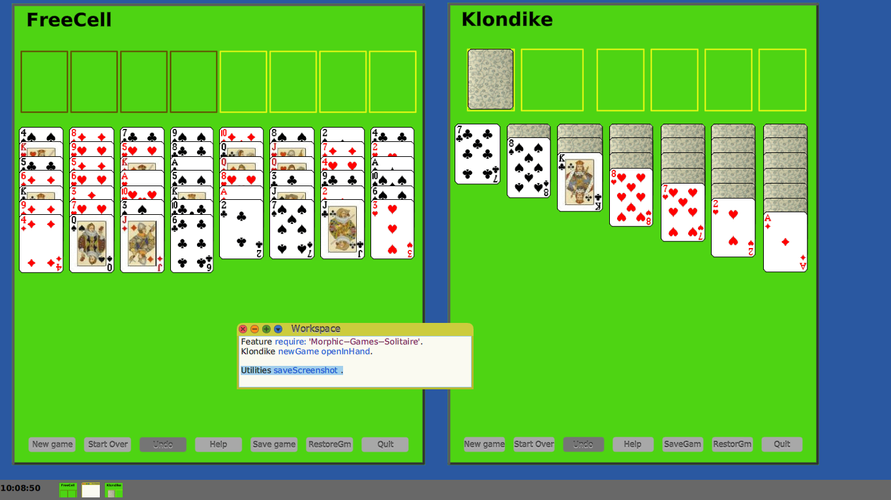

Cuis-Solitaire
==========
Tested with Cuis 7.0

Solitaire:  Klondike & FreeCell Solitaire Games

````Smalltalk
	Feature require: 'Morphic-Games-Solitaire'
````

Then execute

````Smalltalk
    Klondike newGame.
    FreeCell newGame.
````

Or use the World Menu to invoke:  New Morph.. --> Layouts --> FreeCell

You can also scale the card table to fit on your screen via the Morph's edit handles.
  - Cmd-Click on FreeCell
  - Use the blue Change Scale handle on right


